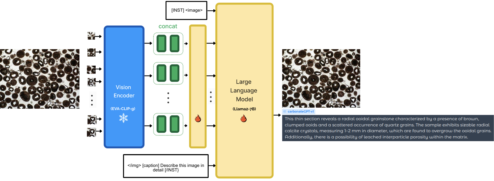

# Vision-Language Models for Automated Carbonate Petrography and Depositional Environment Interpretation
Joshua Atolagbe, Ardiansyah Koeshidayatullah  
Department of Geosciences, King Fahd University of Petroleum and Minerals  
*(Submitted to Artificial Intelligence in Geosciences)*


---
## Model Architecture


## Running Inference

### 1. Installation

```bash
git clone https://github.com/joshua-atolagbe/carbonategptv1
cd carbonategptv1
python -m venv venv
source .venv/bin/activate
pip install requirements.txt
```

### 2. Download Model Weights

- **CarbonateGPTv1 model checkpoint** — download model [here](https://drive.google.com/drive/folders/1ir3jsKCw2roK4JExQlu5YmK_u15zRsTj) and place it somewhere accessible (e.g. `checkpoints/checkpoint_99_EVA.pth`)
- **Llama-2-7b-chat-hf backbone:**
```bash
huggingface-cli download 'meta-llama/Llama-2-7b-chat-hf' --local-dir "./Llama-2-7b-chat-hf"  
```

Then update the two config files to point at your downloaded weights:

| File | Field | Set it to |
|---|---|---|
| `eval_configs/minigptv2_eval.yaml` | `ckpt` | path to finetuned `.pth` checkpoint |
| `minigpt4/configs/models/minigpt_v2.yaml` | `llama_model` | path to `Llama-2-7b-chat-hf` folder |

---

### 3. Batch Inference on a Folder of Images

Use `batch_inference.py` to run the model on all images in a folder. Results are saved to a CSV file.

**Basic usage:**
```python
python batch_inference.py \
    --cfg-path  eval_configs/minigptv2_eval.yaml \
    --image-dir /path/to/your/images/ \
    --question  "[caption] Describe this image in detail." \
    --output    results.csv \
    --gpu-id    0
```

**Multiple questions per image** (create `questions.txt` with one question per line):
```python
python batch_inference.py \
    --cfg-path       eval_configs/minigptv2_eval.yaml \
    --image-dir      /path/to/your/images/ \
    --question-file  questions.txt \
    --output         results.csv \
    --gpu-id         0
```

**Search sub-folders recursively:**
```bash
python batch_inference.py \
    --image-dir /path/to/your/images/ \
    --recursive \
    ...
```

**All available arguments:**

| Argument | Default | Description |
|---|---|---|
| `--cfg-path` | `eval_configs/minigptv2_eval.yaml` | Path to the YAML config file |
| `--image-dir` | *(required)* | Folder containing petrography images |
| `--question` | `"Describe the findings..."` | Question to ask for every image |
| `--question-file` | `None` | `.txt` file with one question per line |
| `--output` | `results.csv` | Output CSV path |
| `--gpu-id` | `0` | GPU index (`-1` for CPU) |
| `--max-new-tokens` | `300` | Maximum tokens to generate |
| `--temperature` | `0.6` | Sampling temperature |
| `--top-p` | `0.9` | Nucleus sampling threshold |
| `--num-beams` | `1` | Beam search width |
| `--repetition-penalty` | `1.05` | Penalises repeated tokens |
| `--recursive` | `False` | Search sub-folders for images |

**Output CSV columns:**

| Column | Description |
|---|---|
| `image_path` | Full path to the image |
| `image_name` | Filename only |
| `question` | The question that was asked |
| `answer` | Model's generated response |
| `error` | Error message if inference failed (otherwise empty) |

> **Note:** The model is loaded once and reused across all images, so there is no repeated loading overhead. The CSV is flushed after every row, so results are preserved even if the run is interrupted.

---

## Credit
All the codes in this repo were adapted [with slight modification] from [MiniGPT-Med](https://github.com/Vision-CAIR/MiniGPT-Med).
